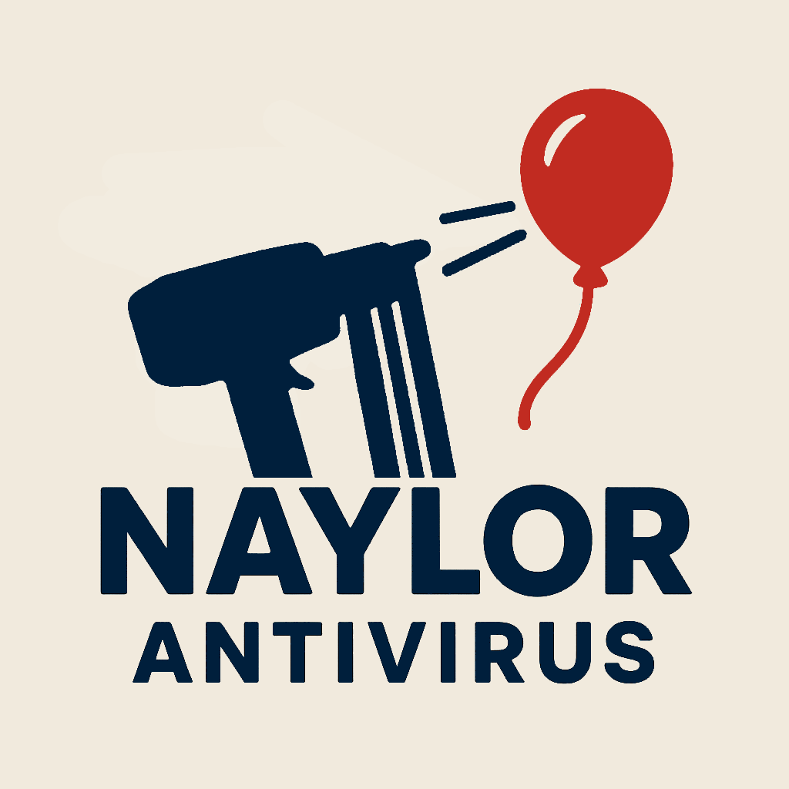

# Naylor-Antivirus

Its crappy malware.

Features:

  Self Replication ❌
  
  Ofuscation ❌
  
  Tunneling ❌
  
  Discord Webhook that got me send the entire bee movie script twice ✅
  
  Epic Logo ✅
  
  Linux functionality ❌
  

Future readers: if you are confused about why this exists, it is because of a great war between bloons and monkeys, where the monkeys were forced to create great weapons of mass destruction to survive. 

---

## Project Purpose
This repository exists for the extremely narrow audience of people who know exactly why they’re here.  
---

## Logo

Every great research project needs a logo, and this one is no exception:  

  

We have carefully considered the pixel dimensions.

---

## Credits

- **Code:** Phil-OS  
- **Logo:** Phil-OS

We acknowledge these contributors not only for their work, but for their bravery in creating the greatest program of all time  

---

## Final Notes  

If you ignore all of the above warnings and still run this code recklessly, may the README gods have mercy on your soul.
